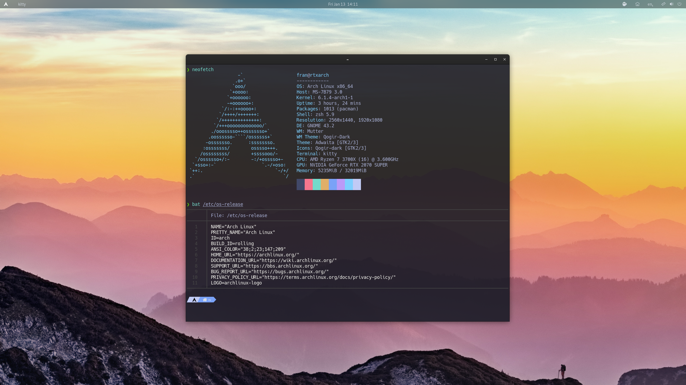
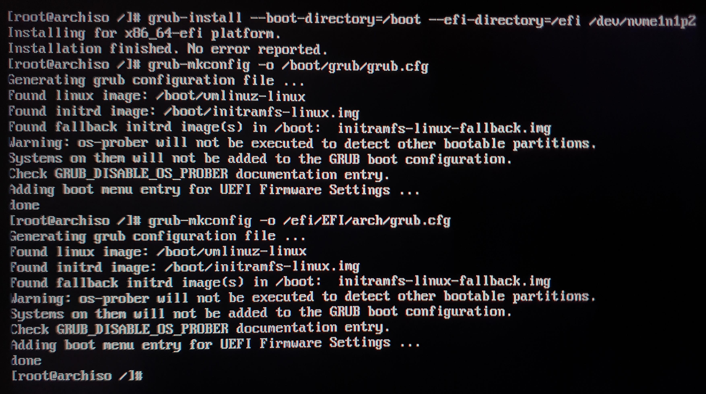

# dotfiles
 Arch Linux dotfiles



***Language***
- 🇺🇸 English
- [🇪🇸 Español](https://github.com/fr4nsys/dotfiles/)

# Table of Contents

- [Fonts, themes and GTK](#fonts-themes-and-gtk)
- [Apps](#apps)
- [Arch Linux Installation](#arch-linux-installation)
- [Installing paru](#install-paru-to-use-aur) 
- [Recomended software](#recomended-software)
- [Set zsh as default shell](#set-zsh-as-default-shell)
- [Install nvidia drivers](#install-nvidia-drivers)

## Fonts, themes and GTK

| Software                                                                               | Utility                                |
| -------------------------------------------------------------------------------------- | -------------------------------------- |
| **[Gnome](https://wiki.archlinux.org/title/GNOME)**                                    | Graphical Environment                  |
| **[Qogir](https://aur.archlinux.org/packages/qogir-icon-theme)**                       | Qogir-dark for icons                   |
| **[Qogir](https://github.com/vinceliuice/Qogir-theme)**                                | Qogir-dark GTK Theme                   |


## Apps

| Software                                                              | Utility                            |
| --------------------------------------------------------------------- | ---------------------------------- |
| **[kitty](https://wiki.archlinux.org/title/kitty)**                   | Terminal Emulator                  |
| **[zsh](https://wiki.archlinux.org/title/Zsh)**                       | Shell                              |
| **[powerlevel10k](https://github.com/romkatv/powerlevel10k)**         | ZSH Theme                          |
| **[nautilus](https://wiki.archlinux.org/title/GNOME/Files)**          | Graphical file manager             |
| **[ranger](https://wiki.archlinux.org/index.php/Ranger)**             | Terminal file manager              |
| **[neovim](https://wiki.archlinux.org/title/Neovim)**                 | Terminal based text editor         |
| **[gedit](https://wiki.archlinux.org/title/GNOME/Gedit)**             | Text editor                        |
| **[shotwell](https://wiki.gnome.org/Apps/Shotwell)**                  | Pictures Viewer & Editor           |
| **[krita](https://krita.org/es/)**                                    | Picture Editor                     |
| **[vlc](https://wiki.archlinux.org/title/VLC_media_player)**          | Video player                       |
| **[firefox](https://wiki.archlinux.org/title/Firefox)**               | Web browser                        |


## Arch Linux Installation

These are my hard disks and partitions in my case I will use the nvme1n1 disk that already has the partitions made because I already had Arch installed and I am only going to format them, here I leave a very good [guide](https://odiseageek.es/posts/instalar-archlinux-con-btrfs-y-encriptacion-luks/) that details all the steps.

```bash
lsblk
```


Formatting boot, EFI and swap partitions

```bash
mkfs.fat -F32 /dev/nvme1n1p1
mkfs.ext4 -L boot /dev/nvme1n1p2
mkswap /dev/nvme1n1p4
swapon
```


I format root partition where the system is going to be installed. In this case the partition is encrypted with luks.

```bash
mkfs.btrfs -L root /dev/mapper/root -f
```


We mount the partitions where we are going to install Arch in /mnt

```bash
mount -t btrfs /dev/mapper/root /mnt 
mkdir /mnt/boot 
mount /dev/nvme1n1p2 /mnt/boot 
mkdir /mnt/efi
mount /dev/nvme1n1p1 /mnt/efi 
```


Preparing pacman GPG keys to avoid problems
```bash
pacman-key --init
pacman-key --populate
pacman-key --refresh-keys
```

Install the basic (required) packages with pacstrap

```bash
pacstrap -K /mnt linux linux-firmware networkmanager grub wpa_supplicant base base-devel efibootmgr nano btrfs-progs
```

Generate the fstab file for the system to identify the partitions

```bash
genfstab -U /mnt > /mnt/etc/fstab
```

Now we are going to enter the system that we have just installed on our hard drive

```bash
arch-chroot /mnt
```


Set the root password and create our user

```bash
passwd
useradd -m fran
passwd fran
usermod -aG wheel fran
```


Configure the /etc/sudoers file

```bash
visudo /etc/sudoers

#Uncoment this line
%wheel ALL=(ALL:ALL) ALL
```


Generate the locale-gen file, set the hostname and timezone
```bash
#Uncomment or add en_US.UTF-8 and es_ES.UTF-8 on /etc/locale.gen
locale-gen
ln -sf /usr/share/zoneinfo/Europe/Madrid /etc/localtime
hwclock --systohc --utc
echo HOSTNAME > /etc/hostname
```


Edit hosts file
```bash
nano /etc/hosts
#Add this lines
127.0.0.1       localhost
::1             localhost
127.0.0.1       HOSTNAME.localhost HOSTNAME
```


We add the root partition at boot time to decrypt it. In my case it is /dev/nvme1n1p3 but I will add it with the UUID since it is unique.
```bash
blkid #To see the UUID of each partition
nano /etc/default/grub
#And we add in GRUB_CMDLINE_LINUX="crypdevice=UUID=YOURUUID:root root=/dev/mapper/root"
```


Now we will also modify the configuration script for the creation of the initrd to decrypt the partition at boot time.
```bash
blkid #To see the UUID of each partition
nano /etc/mkinitcpio.conf
#We look for the first HOOKS without comment (without # in front) and add encrypt and/or the missing ones at the end to make it look like this:
HOOKS=(base udev autodetect modconf kms keyboard keymap consolefont block filesystems fsck encrypt) 
```
Now we run the script to create the boot kernel.
```bash
mkinitcpio -P
```
I have another hard disk that I don't mount as home but I have encrypted and I want to decrypt it at boot time.
```bash
nano /etc/crypttab
#I add the following, I use the UUID but you can use the partition with /dev/sdX:

hdd UUID=YOURUUID   none
```


Installing and configuring grub
```bash
#These commands are for UEFI (you will have to change the partitions to the corresponding ones in your computer)
grub-install --boot-directory=/boot --efi-directory=/efi /dev/nvme1n1p2

grub-mkconfig -o /boot/grub/grub.cfg
grub-mkconfig -o /efi/EFI/arch/grub.cfg

#Commands for BIOS (Legacy)
grub-install /dev/sda
grub-mkconfig -o /boot/grub/grub.cfg
```


Enable the NetworkManager and wpa_supplicant services to have internet at startup.
```bash
systemctl enable NetworkManager.service
systemctl enable wpa_supplicant.service
```

We already have Arch installed and we could reboot, in this case I'm going to install xorg and Gnome and enable it so that when rebooting it already has a graphical environment.
You can install the graphical environment that you want, like KDE, Xfce, Qtile, etc.
```bash
pacman -S git xorg xorg-server gnome
systemctl enable gdm.service
```

Finish the installation and restart the computer.
```bash
exit
reboot now
```


## Install [paru](https://github.com/morganamilo/paru) to use AUR
```bash
sudo pacman -S --needed base-devel
git clone https://aur.archlinux.org/paru-bin.git
cd paru-bin/
makepkg -si
paru
```

## Recomended software
```bash
sudo pacman -Sy firefox kitty ntfs-3g krita materia-gtk-theme vlc mpv zsh zsh-autosuggestions zsh-syntax-highlighting bat lsd neovim unzip zip unrar shotwell transmission-gtk chromium neofetch gnu-free-fonts noto-fonts ttf-bitstream-vera ttf-croscore

paru -S qogir-icon-theme qogir-gtk-theme github-desktop sublime-text-4 vmware-workstation wps-office ttf-wps-fonts ttf-dejavu ttf-droid ttf-ibm-plex ttf-liberation ttf-nerd-fonts-hack-complete-git ttf-meslo-nerd-font-powerlevel10k
```

## Set zsh as default shell
```bash
sudo usermod --shell /usr/bin/zsh fran
sudo usermod --shell /usr/bin/zsh root
```

## Install nvidia drivers
```bash
sudo pacman -S nvidia-dkms lib32-nvidia-utils lib32-opencl-nvidia nvidia-settings nvidia-utils opencl-nvidia egl-wayland
sudo nano /etc/modprobe.d/blacklist.conf
    #Add this lines
    blacklist nouveau
    blacklist rivafb
    blacklist nvidiafb
    blacklist rivatv
    blacklist nv
sudo mkinitcpio -P
sudo reboot now
```
