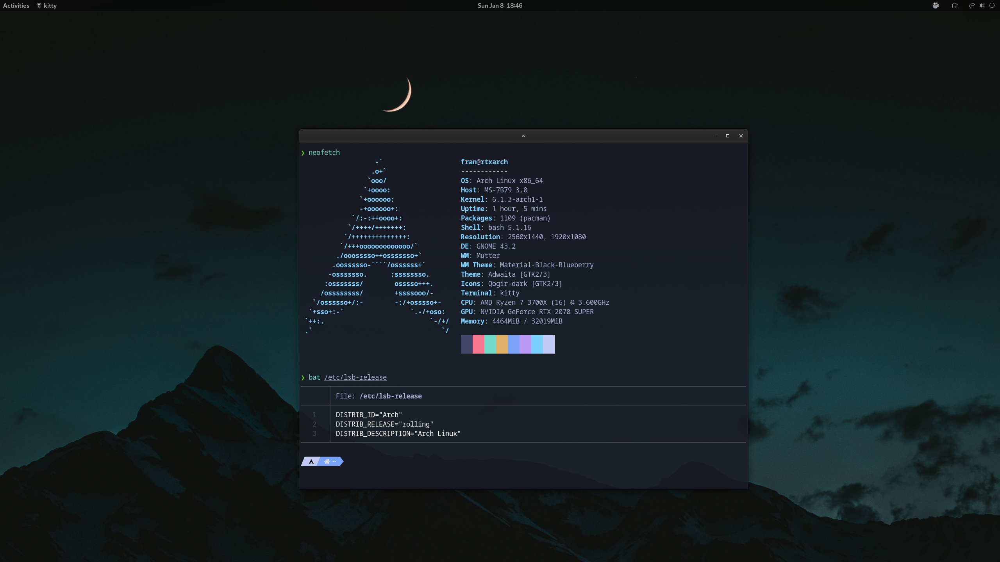
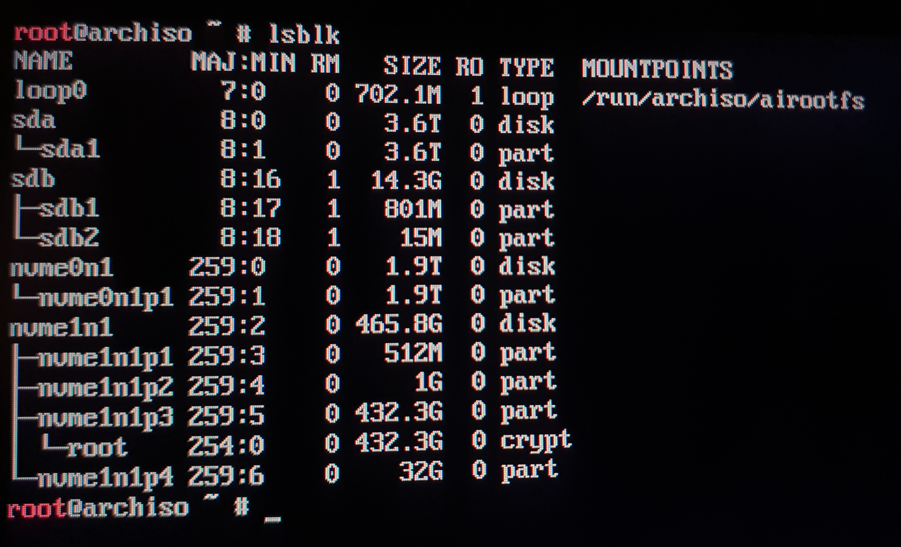
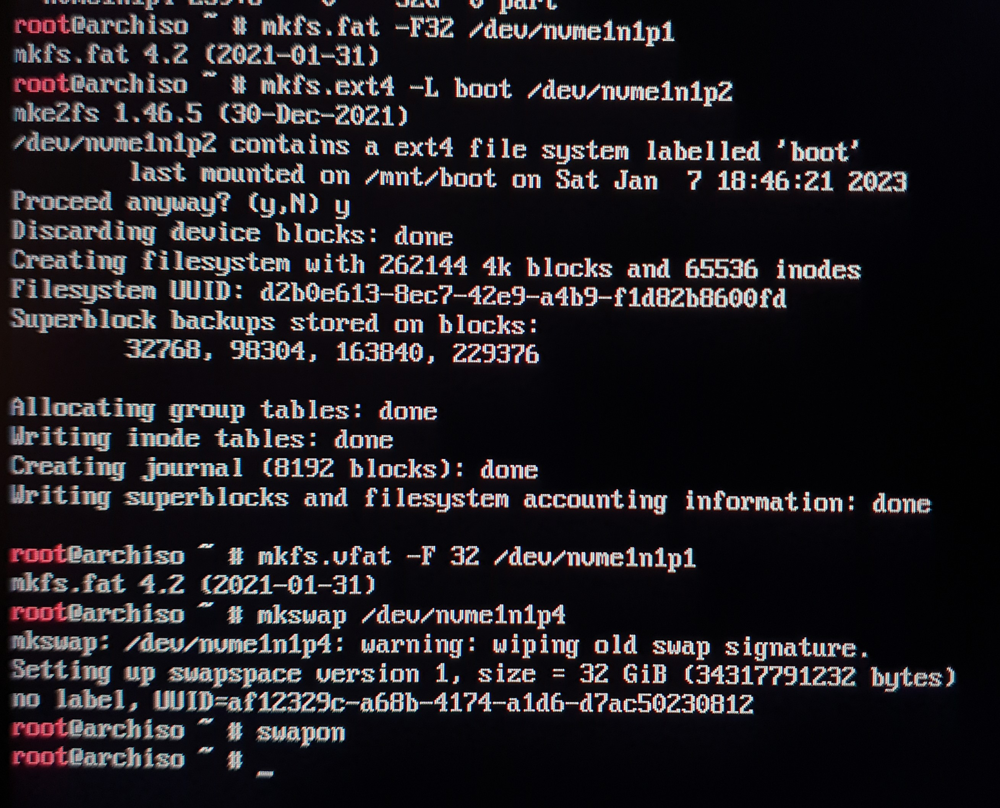
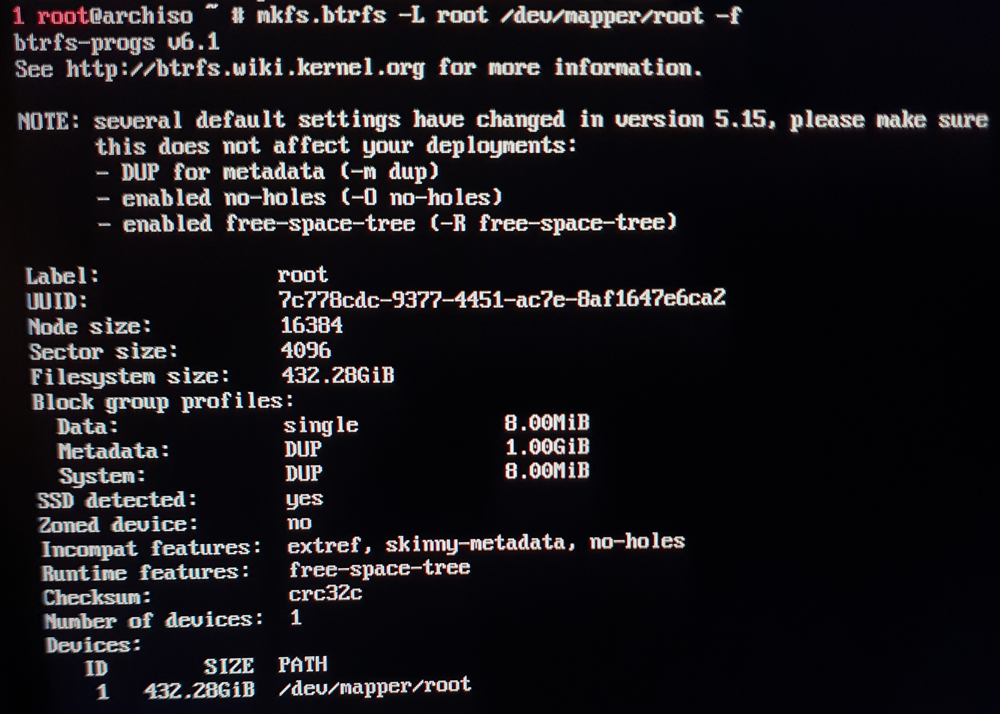
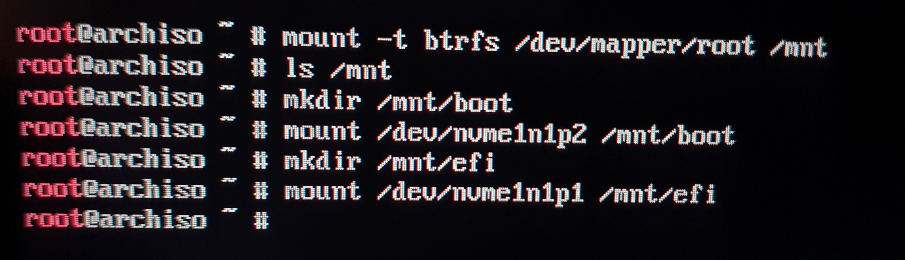
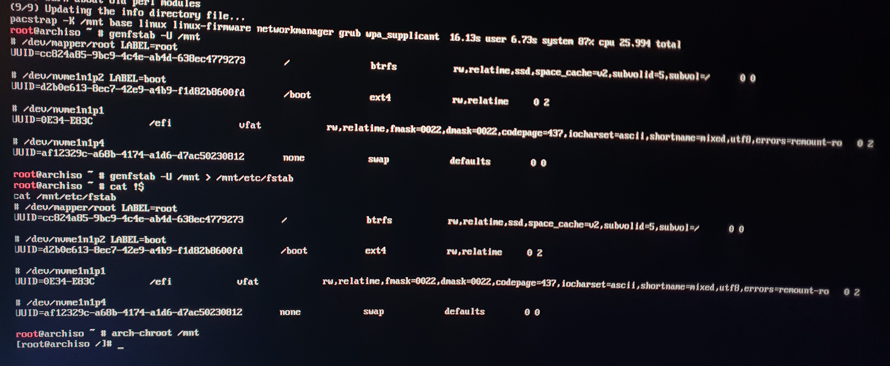
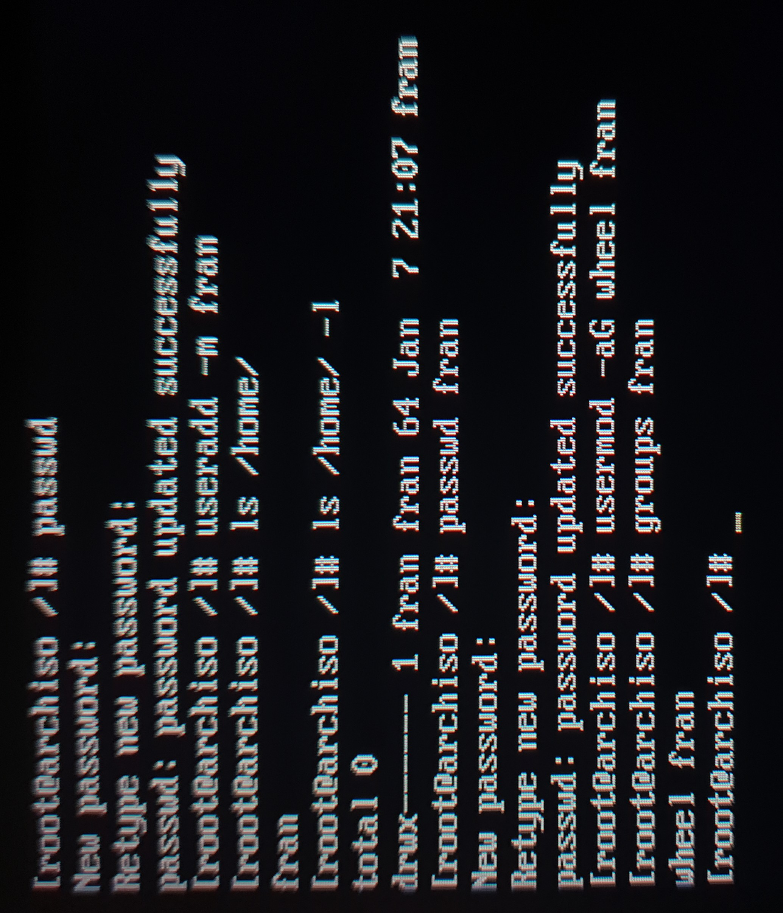
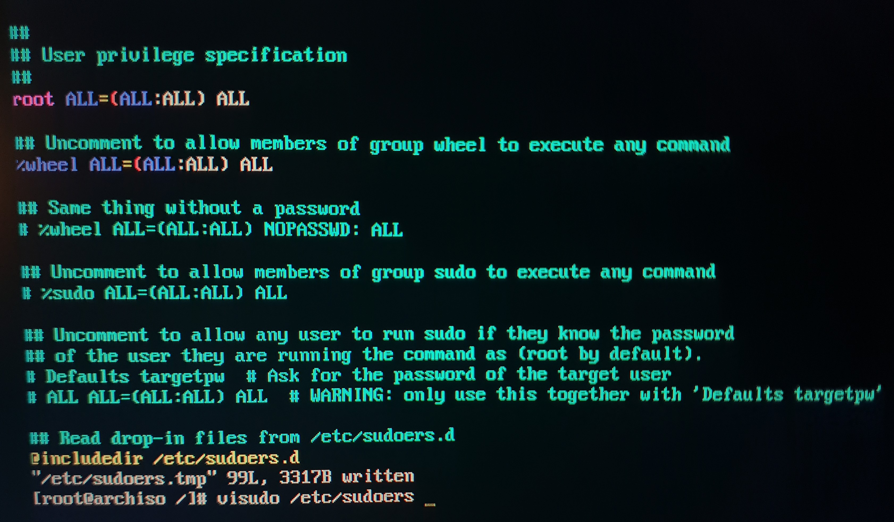
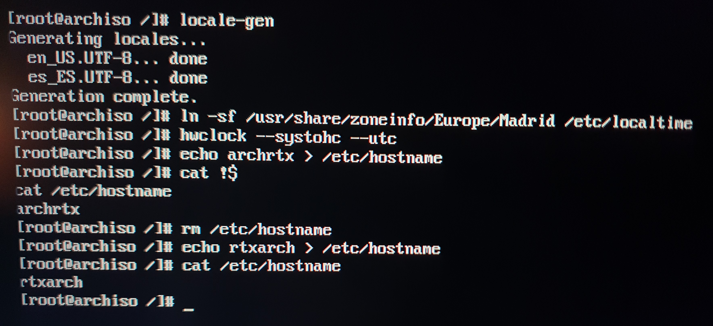
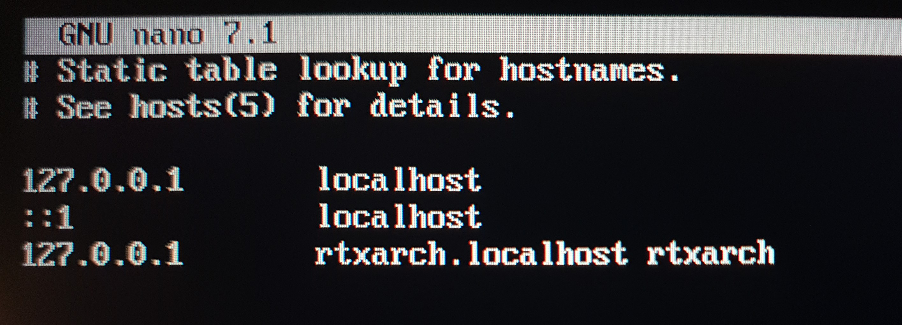

# dotfiles
 Arch Linux dotfiles



***Idioma***
- 🇪🇸 Español
- [🇺🇸 English]

## Instalación (Arch)

Estos son mis discos duros y particiones en mi caso usare el disco nvme1n1 que ya tiene las particiones hechas porque ya tenia Arch instalado y solo las voy a formatear, aqui dejo una [guia](https://odiseageek.es/posts/instalar-archlinux-con-btrfs-y-encriptacion-luks/) muy buena que detalla todos los pasos.

```bash
lsblk
```


Formateo de las particiones boot, EFI y swap

```bash
mkfs.fat -F32 /dev/nvme1n1p1
mkfs.ext4 -L boot /dev/nvme1n1p2
mkswap /dev/nvme1n1p1
swapon
```


Formateo particion root (raiz) en la que se va instalar el sistema. En este caso la particion esta encriptada con luks.

```bash
mkfs.btrfs -L root /dev/mapper/root -f
```


Montamos las particiones en las que vamos a instalar Arch en /mnt

```bash
mount -t btrfs /dev/mapper/root /mnt 
mkdir /mnt/boot 
mount /dev/nvme1n1p2 /mnt/boot 
mkdir /mnt/efi
mount /dev/nvme1n1p1 /mnt/efi 
```


Preparar las claves GPG de pacman para evitar problemas
```bash
pacman-key --init
pacman-key --populate
pacman-key --refresh-keys
```

Instalamos los paquetes basicos (necesarios) con pacstrap

```bash
pacstrap -K /mnt linux linux-firmware networkmanager grub wpa_supplicant base base-devel efibootmgr nano btrfs-progs
```

Generamos el archivo fstab para que el sistema identifique las particiones

```bash
genfstab -U /mnt > /mnt/etc/fstab
```

Ahora ya vamos a entrar en el sistema que acabamos de instalar en nuestro disco duro

```bash
arch-chroot /mnt
```



Establecemos la contrasena de root y creamos nuestro usuario

```bash
passwd
useradd -m fran
passwd fran
usermod -aG wheel fran
```


Configuramos el archivo /etc/sudoers

```bash
visudo /etc/sudoers

#Uncoment this line
%wheel ALL=(ALL:ALL) ALL
```


Generamos el archivo locale-gen, establecemos el hostname y la hora

```bash
#Uncomment or add en_US.UTF-8 and es_ES.UTF-8 on /etc/locale.gen
locale-gen
ln -sf /usr/share/zoneinfo/Europe/Madrid /etc/localtime
hwclock --systohc --utc
echo HOSTNAME > /etc/hostname
```


Editamos el archivo hosts
```bash
nano /etc/hosts
#Add this lines
127.0.0.1       localhost
::1             localhost
127.0.0.1       HOSTNAME.localhost HOSTNAME
```


In progress...