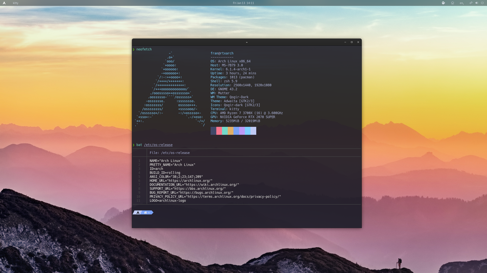
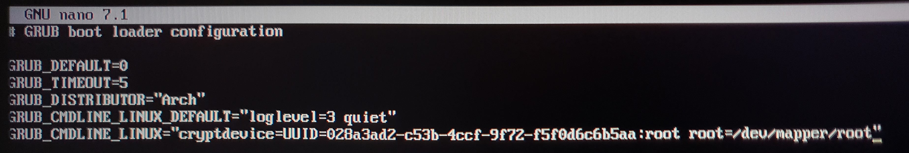
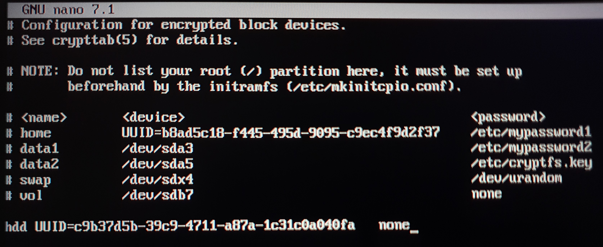
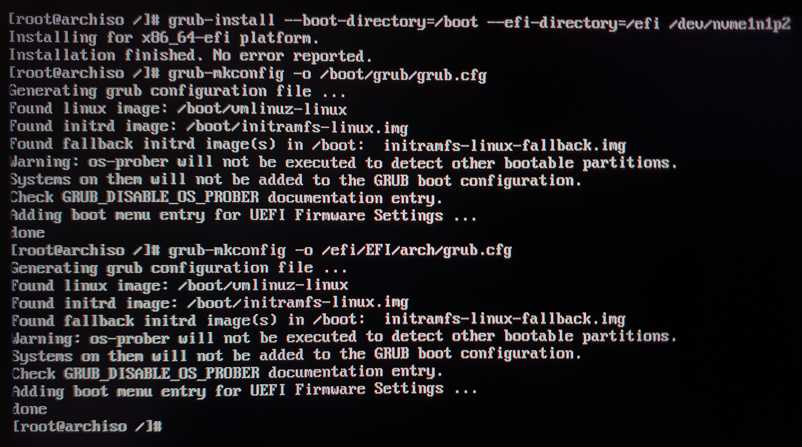
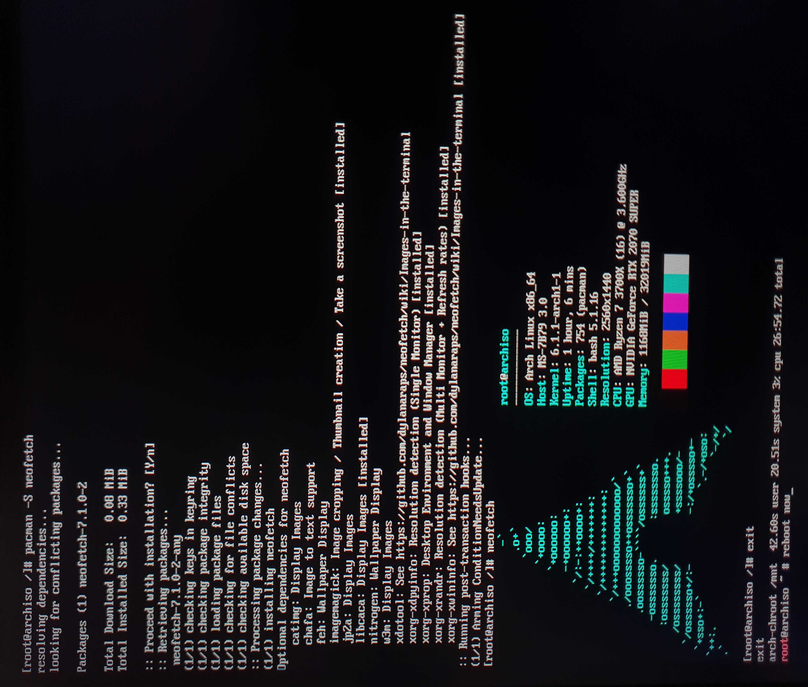

# dotfiles
 Arch Linux dotfiles



***Idioma***
- 🇪🇸 Español
- [🇺🇸 English](https://github.com/fr4nsys/dotfiles/blob/main/README-ENG.md) 

# Índice

- [Fuentes, temas y GTK](#fuentes-temas-y-gtk)
- [Apps](#apps)
- [Instalación de Arch Linux](#instalación-(arch))
- [Instalar paru](#instalar-paru-para-usar-aur)
- [Software recomendado](#software-recomendado)
- [Establecer zsh como bash predeterminada](#establecer-zsh-como-bash-predeterminada)
- [Instalar drivers de nvidia](#instalar-drivers-de-nvidia)

## Fuentes, temas y GTK

| Software                                                                               | Utilidad                               |
| -------------------------------------------------------------------------------------- | -------------------------------------- |
| **[Gnome](https://wiki.archlinux.org/title/GNOME)**                                    | Entorno grafico                        |
| **[Qogir](https://aur.archlinux.org/packages/qogir-icon-theme)**                       | Qogir-dark para iconos                 |
| **[Qogir](https://github.com/vinceliuice/Qogir-theme)**                                | Qogir-dark Thema GTK                   |


## Apps

| Software                                                              | Utilidad                           |
| --------------------------------------------------------------------- | ---------------------------------- |
| **[kitty](https://wiki.archlinux.org/title/kitty)**                   | Emulador de Terminal               |
| **[zsh](https://wiki.archlinux.org/title/Zsh)**                       | Shell                              |
| **[powerlevel10k](https://github.com/romkatv/powerlevel10k)**         | Tema ZSH                           |
| **[nautilus](https://wiki.archlinux.org/title/GNOME/Files)**          | Gestor de archivos gráfico         |
| **[ranger](https://wiki.archlinux.org/index.php/Ranger)**             | Gestor de archivos de terminal     |
| **[neovim](https://wiki.archlinux.org/title/Neovim)**                 | Editor de texto basado en terminal |
| **[gedit](https://wiki.archlinux.org/title/GNOME/Gedit)**             | Editor de texto                    |
| **[shotwell](https://wiki.gnome.org/Apps/Shotwell)**                  | Visor y editor de imagenes         |
| **[krita](https://krita.org/es/)**                                    | Editor de imagenes                 |
| **[vlc](https://wiki.archlinux.org/title/VLC_media_player)**          | Reproductor de video               |
| **[firefox](https://wiki.archlinux.org/title/Firefox)**               | Navegador web                      |


## Instalación (Arch)

Estos son mis discos duros y particiones en mi caso usare el disco nvme1n1 que ya tiene las particiones hechas porque ya tenia Arch instalado y solo las voy a formatear, aqui dejo una [guia](https://odiseageek.es/posts/instalar-archlinux-con-btrfs-y-encriptacion-luks/) muy buena que detalla todos los pasos.

```bash
lsblk
```


Formateo de las particiones boot, EFI y swap

```bash
mkfs.fat -F32 /dev/nvme1n1p1
mkfs.ext4 -L boot /dev/nvme1n1p2
mkswap /dev/nvme1n1p4
swapon
```


Formateo particion root (raiz) en la que se va instalar el sistema. En este caso la particion esta encriptada con luks.

```bash
mkfs.btrfs -L root /dev/mapper/root -f
```


Montamos las particiones en las que vamos a instalar Arch en /mnt

```bash
mount -t btrfs /dev/mapper/root /mnt 
mkdir /mnt/boot 
mount /dev/nvme1n1p2 /mnt/boot 
mkdir /mnt/efi
mount /dev/nvme1n1p1 /mnt/efi 
```


Preparar las claves GPG de pacman para evitar problemas
```bash
pacman-key --init
pacman-key --populate
pacman-key --refresh-keys
```

Instalamos los paquetes basicos (necesarios) con pacstrap

```bash
pacstrap -K /mnt linux linux-firmware networkmanager grub wpa_supplicant base base-devel efibootmgr nano btrfs-progs
```

Generamos el archivo fstab para que el sistema identifique las particiones

```bash
genfstab -U /mnt > /mnt/etc/fstab
```

Ahora ya vamos a entrar en el sistema que acabamos de instalar en nuestro disco duro

```bash
arch-chroot /mnt
```


Establecemos la contrasena de root y creamos nuestro usuario

```bash
passwd
useradd -m fran
passwd fran
usermod -aG wheel fran
```


Configuramos el archivo /etc/sudoers

```bash
visudo /etc/sudoers

#Uncoment this line
%wheel ALL=(ALL:ALL) ALL
```


Generamos el archivo locale-gen, establecemos el hostname y la hora

```bash
#Uncomment or add en_US.UTF-8 and es_ES.UTF-8 on /etc/locale.gen
locale-gen
ln -sf /usr/share/zoneinfo/Europe/Madrid /etc/localtime
hwclock --systohc --utc
echo HOSTNAME > /etc/hostname
```


Editamos el archivo hosts
```bash
nano /etc/hosts
#Add this lines
127.0.0.1       localhost
::1             localhost
127.0.0.1       HOSTNAME.localhost HOSTNAME
```


Añadimos la partición root en el arranque para desencriptarla. En mi caso es /dev/nvme1n1p3 pero la añadire con el UUID ya que es unico.
```bash
blkid #Para ver el UUID de cada particion
nano /etc/default/grub
#Y añadimos en GRUB_CMDLINE_LINUX="crypdevice=UUID=YOURUUID:root root=/dev/mapper/root"
```


Ahora modificaremos también el script de configuración para la creación del initrd y poder desencriptar la partición en el arranque.
```bash
blkid #Para ver el UUID de cada particion
nano /etc/mkinitcpio.conf
#Buscamos el primer HOOKS sin comentar (sin # delante) y añadimos encrypt y/o las que falten al final para que quede asi:
HOOKS=(base udev autodetect modconf kms keyboard keymap consolefont block filesystems fsck encrypt) 
```
Ahora ejecutamos el script para crear el núcleo de arranque.
```bash
mkinitcpio -P
```
Tengo otro disco duro que no monto como home pero tengo encriptado y quiero desencriptarlo en el arranque.
```bash
nano /etc/crypttab
#Añado lo siguiente, yo uso el UUID pero podeis usar la particion con /dev/sdX:

hdd UUID=YOURUUID   none
```



Instalar y configurar grub
```bash
#Estos comandos son para UEFI (deberás cambiar las particiones a las que corresponda en tu equipo)
grub-install --boot-directory=/boot --efi-directory=/efi /dev/nvme1n1p2

grub-mkconfig -o /boot/grub/grub.cfg
grub-mkconfig -o /efi/EFI/arch/grub.cfg

#Comandos para BIOS
grub-install /dev/sda
grub-mkconfig -o /boot/grub/grub.cfg
```


Habilitamos los servicios NetworkManager y wpa_supplicant para tener internet al iniciar el equipo.
```bash
systemctl enable NetworkManager.service
systemctl enable wpa_supplicant.service
```

Ya tenemos Arch instalado y podriamos reinicar, en este caso voy a instalar xorg y Gnome y habilitarlo para que al reiniciar ya tenga entorno gráfico.
Tú puedes instalar el entorno gráfico que quieras como KDE, Xfce, Qtile, etc.
```bash
pacman -S git xorg xorg-server gnome
systemctl enable gdm.service
```

Finalizamos la instalación y reiniciamos el equipo.
```bash
exit
reboot now
```


## Instalar [paru](https://github.com/morganamilo/paru) para usar AUR
```bash
sudo pacman -S --needed base-devel
git clone https://aur.archlinux.org/paru-bin.git
cd paru-bin/
makepkg -si
paru
```

## Software recomendado
```bash
sudo pacman -Sy firefox kitty ntfs-3g krita materia-gtk-theme vlc mpv zsh zsh-autosuggestions zsh-syntax-highlighting bat lsd neovim unzip zip unrar shotwell transmission-gtk chromium neofetch gnu-free-fonts noto-fonts ttf-bitstream-vera ttf-croscore

paru -S qogir-icon-theme qogir-gtk-theme github-desktop sublime-text-4 vmware-workstation wps-office ttf-wps-fonts ttf-dejavu ttf-droid ttf-ibm-plex ttf-liberation ttf-nerd-fonts-hack-complete-git ttf-meslo-nerd-font-powerlevel10k
```

## Establecer zsh como bash predeterminada
```bash
sudo usermod --shell /usr/bin/zsh fran
sudo usermod --shell /usr/bin/zsh root
```

## Instalar drivers de nvidia
```bash
sudo pacman -S nvidia-dkms lib32-nvidia-utils lib32-opencl-nvidia nvidia-settings nvidia-utils opencl-nvidia egl-wayland
sudo nano /etc/modprobe.d/blacklist.conf
    #Add this lines
    blacklist nouveau
    blacklist rivafb
    blacklist nvidiafb
    blacklist rivatv
    blacklist nv
sudo mkinitcpio -P
sudo reboot now
```
